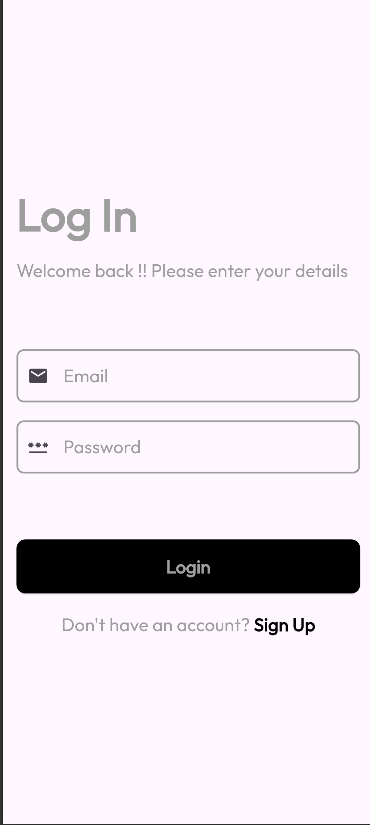
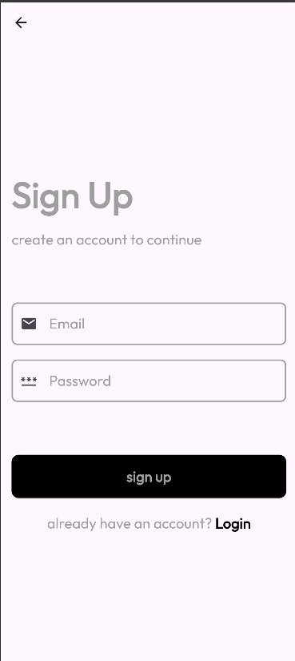
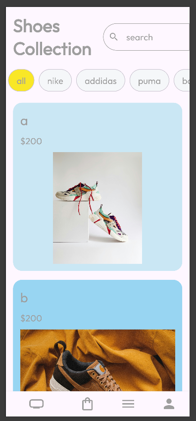
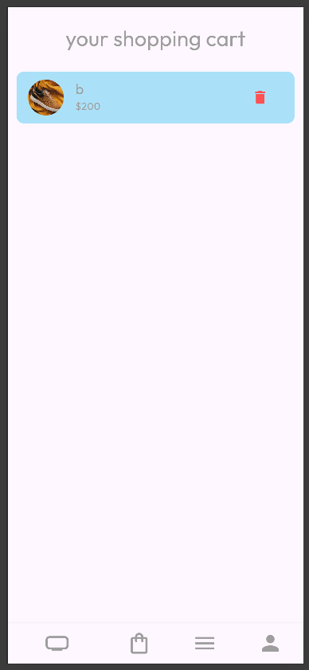
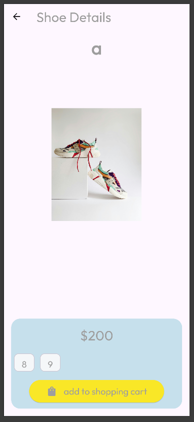
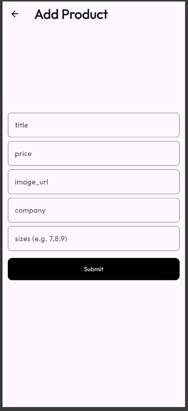
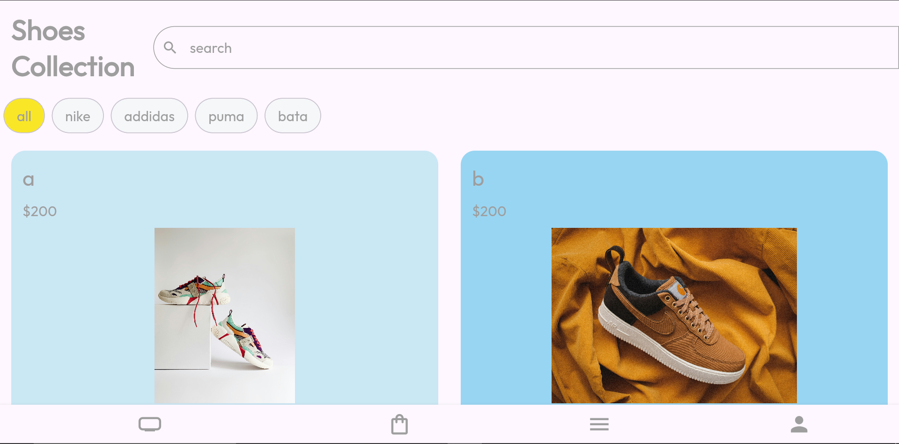

# 🛍️ Shop App

A modern, Flutter application with Firebase backend integration. This app demonstrates a shopping experience with authentication, product management, cart functionality, and responsive design for both mobile and web platforms.

---

## 📋 Overview

**Shop App** is a cross-platform mobile and web application built with Flutter and Firebase. It offers a seamless shopping experience where users can browse products, manage their shopping cart, and add new products to the store. The app features Firebase Authentication for secure user management and Cloud Firestore for real-time data synchronization.

### ✨ Key Features

- 🔐 **Authentication System** - Secure login and signup with Firebase Auth
- 🛒 **Shopping Cart** - Add, view, and manage cart items with Provider state management
- 📦 **Product Management** - Browse products with responsive grid/list views
- ➕ **Add Products** - Create and submit new products to Firestore
- 🗑️ **Swipe to Delete** - Intuitive dismissible product cards
- 📱 **Responsive Design** - Optimized layouts for mobile and web (adaptive GridView)
- 🎨 **Modern UI** - Clean interface with custom fonts (Outfit) and Material 3 design
- ⚡ **Real-time Updates** - Live product feed with Firestore streams
- 🌐 **Multi-platform** - Runs on Android, iOS, Web, macOS, Linux, and Windows

---

## 🛠️ Tech Stack

| Technology | Purpose |
|------------|---------|
| **Flutter** `SDK ^3.9.2` | Cross-platform UI framework |
| **Firebase Core** `^4.1.0` | Firebase SDK initialization |
| **Firebase Auth** `^6.0.2` | User authentication |
| **Cloud Firestore** `^6.0.1` | Real-time database |
| **Provider** `^6.1.5+1` | State management |
| **Material 3** | Modern design system |

---

## 📱 App Architecture

```
lib/
├── screens/               # Main application screens
│   ├── login_page.dart
│   ├── signup_page.dart
│   ├── homepage.dart
│   ├── cart_page.dart
│   ├── product_details_page.dart
│   ├── add_product.dart
│   ├── menu_screen.dart
│   └── signout_page.dart
├── helper_Widgets/        # Reusable components
│   ├── homepage_body.dart
│   ├── product_card.dart
│   └── cart_provider.dart
├── firebase_options.dart  # Firebase configuration
└── main.dart             # App entry point
```

---

## 🚀 Getting Started

### Prerequisites

- Flutter SDK `^3.9.2` or higher
- Dart SDK
- Firebase account with a configured project
- Android Studio / VS Code / Xcode (for platform-specific builds)

### Installation

1. **Clone the repository**
   ```bash
   git clone https://github.com/ShomailKhan/shop_app.git
   cd shop_app
   ```

2. **Install dependencies**
   ```bash
   flutter pub get
   ```

3. **Configure Firebase**
   - Create a Firebase project at [console.firebase.google.com](https://console.firebase.google.com)
   - Enable **Firebase Authentication** (Email/Password provider)
   - Enable **Cloud Firestore Database**
   - Download and configure platform-specific files:
     - Android: `google-services.json` → `android/app/`
     - iOS: `GoogleService-Info.plist` → `ios/Runner/`
     - Web: Configure in `firebase_options.dart` (auto-generated by FlutterFire CLI)

4. **Run the app**
   ```bash
   # For mobile
   flutter run

   # For web
   flutter run -d chrome

   # For desktop
   flutter run -d windows  # or macos/linux
   ```

---

## 📸 Screenshots

### 🔐 Authentication Screens

<p align="center">
  
  
</p>

*Login screen with email/password fields, signup with validation, and authentication loading state.*

---

### 🏠 Home & Product Browsing

<p align="center">
  
  
</p>

*Product browsing with list/grid views*

---

### 🛒 Shopping Cart

<p align="center">
  
</p>

*Shopping cart page with product list, swipe-to-delete gesture*

---

### 📦 Product Details

<p align="center">
  
</p>

*Product detail view with image display, size selection chips, and add-to-cart functionality.*

---

### ➕ Add Product

<p align="center">
  
</p>

*Add product form with input fields for id, title, price, image URL, company, sizes, and success feedback.*

---

### 🌐 Web View

<p align="center">
  

</p>

*Responsive web layout with desktop navigation and adaptive grid view on larger screens.*

---

## 🧪 Testing

Run tests with:
```bash
flutter test
```

---

## 🤝 Contributing

Contributions are welcome! Please follow these steps:

1. Fork the repository
2. Create a feature branch (`git checkout -b feature/amazing-feature`)
3. Commit your changes (`git commit -m 'Add amazing feature'`)
4. Push to the branch (`git push origin feature/amazing-feature`)
5. Open a Pull Request

---

## 👤 Author

**Shomail Khan**
- GitHub: [@ShomailKhan](https://github.com/ShomailKhan)

---

## 🙏 Acknowledgments

- Flutter team for the amazing framework
- Firebase for backend services
- Material Design for UI guidelines
- The Flutter community for packages and support

---

<div align="center">
  Made with ❤️ using Flutter
</div>
